# Legal-based RAG Project Architecture

## System Overview

This is a legal document search system with conversational AI interface, combining vector search, keyword search, and LLM reasoning. 
Documents in collection:
Iowa code (state law),
Iowa administrative code,
Iowa constitution,
US code (federal law),
US constitution,
US code of federal regulations. 

Overall 3 million+ embeddings, and 250,000+ pages of data.

---

## 1. High-Level Architecture

```mermaid
graph LR
    User[👤 User] --> ChatAgent[Chat Agent]
    
    ChatAgent -->|Direct| Direct[Internal Knowledge]
    ChatAgent -->|Search| SearchAgent[Search Agent]
    
    SearchAgent --> HybridSearch[Hybrid Search<br/>Internal Documents]
    SearchAgent --> WebSearch[Web Search<br/>External]
    
    Direct --> Results[📄 Results]
    HybridSearch --> Results
    WebSearch --> Results
    
    style ChatAgent fill:#e1f5ff
    style Direct fill:#c8e6c9
    style SearchAgent fill:#f3e5f5
    style HybridSearch fill:#fff3e0
    style WebSearch fill:#fff3e0
```



**Three Response Modes:**
1. **Direct Response**: Greetings, clarifications, general knowledge (no search)
2. **Hybrid Search**: Query internal document collections (ChromaDB + Elasticsearch)
3. **Web Search**: External web search for out-of-corpus queries

---

## 2. Search Flow (Main Pipeline with Self-Correction)

```mermaid
graph TD
    A[User Query] --> B[ChatAgent]
    B --> C[SearchAgent]
    C --> D[QueryProcessor<br/>Expand query into subqueries]
    D --> E[SearchMethodSelector<br/>Choose: Hybrid or Web search]
    
    E -->|Hybrid| F[HybridSearch<br/>Vector + Keyword search]
    E -->|Web| G[WebSearch<br/>External search]
    
    F --> H[BGEReranker<br/>Rerank top results]
    H --> I[DocumentSummarizer<br/>Summarize documents]
    
    G --> I
    
    I -->|Need more context for document chunks| Tools[Tool Calls<br/>GetChunkNeighbors<br/>GetChunkByID]
    Tools --> I
    
    I --> J[ResultSynthesizer<br/>Combine into final answer]
    
    J -->|Need more info| Research[SearchTool<br/>New search]
    Research --> C
    
    J --> K[📝 Final Answer]
    
    style D fill:#ffe0b2
    style E fill:#c8e6c9
    style F fill:#b3e5fc
    style H fill:#f8bbd0
    style I fill:#e1bee7
    style J fill:#ffccbc
    style Tools fill:#c8e6c9
    style Research fill:#fff9c4
```



---

## 3. Hybrid Search Details


---

## 4. Document Processing Pipeline

### Option A: LLM-Based Preprocessing

```mermaid
graph LR
    PDF[📄 PDF Files] --> LLMPre[LLM_PDF_Preprocessor<br/>Gemini chunks by page]
    LLMPre --> JSON[JSON Chunks<br/>with metadata]
    JSON --> Indexer[PDFIndexer]
    Indexer --> Embed[BGEEmbeddings]
    Embed --> VectorDB[(ChromaDB)]
    Indexer --> ES[(Elasticsearch)]
    
    style LLMPre fill:#e1bee7
    style Indexer fill:#ffccbc
    style Embed fill:#c8e6c9
```


### Option B: Naive Preprocessing

```mermaid
graph LR
    PDF[📄 PDF Files] --> Naive[NaivePDFPreprocessor<br/>Markdown + heading detection]
    Naive --> Chunks[Validated Chunks]
    Chunks --> Embed[BGEEmbeddings]
    Chunks --> ES[(Elasticsearch)]
    Embed --> VectorDB[(ChromaDB)]
    
    style Naive fill:#ffccbc
    style Embed fill:#c8e6c9
```


---

## 5. Core Components & Singletons


---

## 6. ChatAgent Intelligence & Memory

### Decision Flow


**Response Modes:**
| Mode | When | Example |
|------|------|---------|
| **Direct** | Greetings, clarifications, general knowledge | *"Hello"*, *"Clarify that?"*, *"Thanks"* |
| **SimpleSearch** | Single straightforward question | *"Speed limit in Iowa?"* |
| **SequentialSearch** | Multi-step questions where answers build on each other | *"Who can file for emancipation and what are their rights afterward?"* |

**Memory:** Rolling window (10 turns) with automatic compression to summaries

**Sequential Search Example:**
```
Query: "Who can petition for emancipation in Iowa and what rights do they gain?"
→ Step 1: Search "emancipation petition requirements Iowa" → Find age, residency requirements
→ Step 2: Search "rights granted after emancipation Iowa" (using Step 1's found requirements as context)
→ Step 3: Synthesize: "Minors aged 16+ meeting X criteria can petition, gaining rights to Y"
```

### Self-Correction & Agent Tools

```mermaid
graph TD
    Query[Search Query] --> Results[Reranked Results<br/>from Hybrid/Web Search]
    Results --> Check{Search Type?}
    
    Check -->|Hybrid| Doc[DocumentSummarizer<br/>If needs more context:<br/>GetChunkNeighbors/ByID<br/>Max 5x]
    Check -->|Web| Synth[ResultSynthesizer]
    
    Doc --> Synth[ResultSynthesizer<br/>Max 3 re-searches]
    
    Synth -->|Needs more info| ReSearch[New search]
    ReSearch --> Query
    
    Synth -->|Complete| Answer[Final Answer]
    Synth -->|Max attempts| WebFallback[⚠️ Fallback to WebSearch]
    WebFallback --> Answer
    
    style Check fill:#fff9c4
    style Doc fill:#e1bee7
    style Synth fill:#ffccbc
    style WebFallback fill:#ffccbc
```



**Two-Level Self-Correction:**
| Level | Actions | Limit | Scope |
|-------|---------|-------|-------|
| **Context Refinement** | GetChunkNeighbors, GetChunkByID | 5x | Hybrid search only |
| **Re-searching** | New refined searches | 3x → WebSearch fallback | All searches |

---

## Component Reference

| Component | Type | Purpose |
|-----------|------|---------|
| **ChatAgent** | Interface | Conversation management, decides response mode, delegates to SearchAgent |
| **SearchAgent** | Orchestrator | Coordinates search pipeline, parallel subquery execution |
| **QueryProcessor** | LLM | Expands queries into subqueries |
| **SearchMethodSelector** | LLM | Chooses hybrid vs web search, fallback to web at limit |
| **DocumentSummarizer** | LLM | Summarizes results, fetches context (5x max, hybrid only) |
| **ResultSynthesizer** | LLM | Combines results, re-searches (3x max) with web fallback |
| **HybridSearch** | Search | ChromaDB (vector) + Elasticsearch (BM25) → RRF → Rerank |
| **WebSearch** | Search | External web search for out-of-corpus queries |
| **VectorDatabaseClient** | Singleton | ChromaDB connection manager |
| **ElasticSearchClient** | Data | BM25 keyword search and indexing |
| **BGEEmbeddings** | Singleton | bge-m3 model for embeddings |
| **BGEReranker** | Singleton | bge-reranker-large cross-encoder |
| **PDFIndexer** | Processor | JSON chunks → embeddings → both databases |
| **LLM_PDF_Preprocessor** | Processor | Gemini-based PDF chunking with metadata |
| **NaivePDFPreprocessor** | Processor | Markdown-based chunking with heading detection |

---

## Design Patterns & Key Features

**Singleton Pattern:** VectorDatabaseClient, BGEEmbeddings, BGEReranker (prevent OOM, thread-safe)

**Tool-Based Self-Correction:** LLMs dynamically decide:
- Search strategy (hybrid vs web)
- Context refinement (GetChunkNeighbors 5x)
- Re-searching (3x with web fallback)
- All with iteration limits to prevent infinite loops

**Separation of Concerns:** Query processing → Search execution → Result synthesis

**Parallel Execution:** ThreadPoolExecutor for subqueries and tool calls

---

## Example Flows

**Simple Search (Direct):**
```
"What is the speed limit in Iowa school zones?"
→ ChatAgent → SearchAgent → Expand to subqueries
→ Hybrid search finds relevant chunks
→ DocumentSummarizer creates answer from top results
→ ResultSynthesizer returns final answer
```

**Simple Search (With Self-Correction):**
```
"What are penalties for repeat DUI offenses in Iowa?"
→ Initial search finds general DUI info
→ DocumentSummarizer needs more context → GetChunkNeighbors (2x iterations)
→ Still incomplete → ResultSynthesizer re-searches with refined query
→ Complete answer found
```

**Worst Case (Max Attempts):**
```
Query about obscure topic not in corpus
→ Multiple searches fail to find sufficient info
→ Re-search attempts exhausted (3x)
→ Automatic fallback to WebSearch
→ Returns best available answer from web
```

**Sequential Search:**
```
"If someone is convicted of theft in Iowa, can they later get a professional license?"
→ Step 1: Search "theft conviction penalties Iowa" → Find: Class D felony, specific restrictions
→ Step 2: Search "professional licensing with felony conviction Iowa" 
   (using Step 1's felony classification to inform search)
→ Step 3: Search "license restoration process Iowa" (using both previous answers)
→ Synthesize: Complete answer about conviction impact + restoration path
```

**Indexing:**
```
PDF → Preprocessor (LLM/Naive) → Chunks
→ BGEEmbeddings → ChromaDB
→ Same chunks → Elasticsearch
```

---

## Technology Stack & Performance

| Component | Technology | Performance Notes |
|-----------|-----------|-------------------|
| Vector Database | ChromaDB (HNSW) | Singleton connection, thread-safe |
| Keyword Search | Elasticsearch (BM25) | Parallel with vector search |
| Embeddings | BAAI/bge-m3 | Singleton, GPU-accelerated |
| Reranker | BAAI/bge-reranker-large | Singleton with mutex |
| LLM | Google Gemini 2.5 Flash | Query expansion & synthesis |
| PDF Processing | PyMuPDF, LangChain | Streaming for memory efficiency |
| Orchestration | ThreadPoolExecutor | Parallel subqueries & tool calls |

